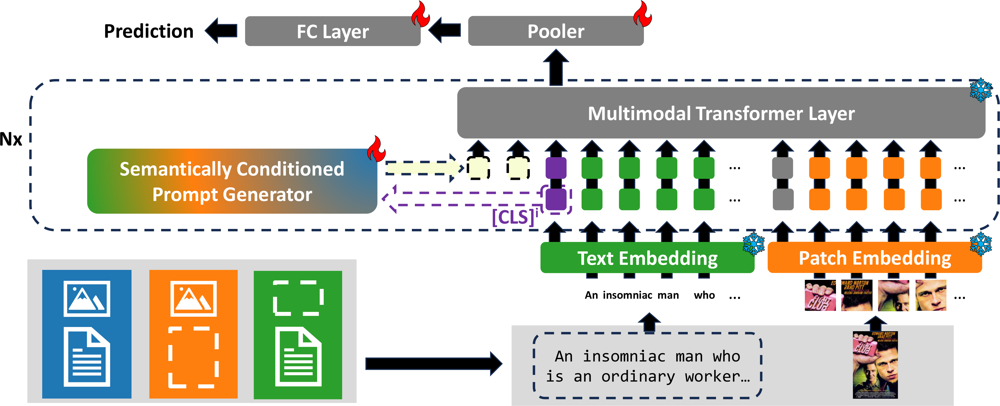

# Semantically Conditioned Prompts for Visual Recognition under Missing Modality Scenarios (WACV 2025)
Official PyTorch implementaton of WACV 2025 paper Semantically Conditioned Prompts for Visual Recognition under Missing Modality Scenarios.  

## Introduction
This paper tackles the domain of multimodal prompting for visual recognition, specifically when dealing with missing modalities through multimodal Transformers. It presents two main contributions: (i) we introduce a novel prompt learning module which is designed to produce sample-specific prompts and (ii) we show that modality-agnostic prompts can effectively adjust to diverse missing modality scenarios. Our model, termed *SCP*, exploits the semantic representation of available modalities to query a learnable memory bank, which allows the generation of prompts based on the semantics of the input. 
Notably, *SCP* distinguishes itself from existing methodologies for its capacity of self-adjusting to both the missing modality scenario and the semantic context of the input, without prior knowledge about the specific missing modality and the number of modalities.
Through extensive experiments, we show the effectiveness of the proposed prompt learning framework and demonstrate enhanced performance and robustness across a spectrum of missing modality cases.
<div align="center">
  
</div>

## Usage
### Enviroment
#### Prerequisites
Python = 3.7.13

Pytorch = 1.10.0

CUDA = 11.3

#### Other requirements
```
pip install -r requirements_local.txt
```

### Prepare Dataset
We use three vision and language datasets: [MM-IMDb](https://github.com/johnarevalo/gmu-mmimdb), [UPMC Food-101](https://visiir.isir.upmc.fr/explore), and [Hateful Memes](https://ai.facebook.com/blog/hateful-memes-challenge-and-data-set/). Please download the datasets by yourself. We use `pyarrow` to serialize the datasets, the conversion codes are located in `vilt/utils/wirte_*.py`. Please see `DATA.md` to organize the datasets, otherwise you may need to revise the `write_*.py` files to meet your dataset path and files. Run the following script to create the pyarrow binary file:
```
python make_arrow.py --dataset [DATASET] --root [YOUR_DATASET_ROOT]
```

### Train and Evaluate (SPC)
1. Download the pre-trained ViLT model weights from [here](https://github.com/dandelin/ViLT.git).

2. Start to train.
```
python run_main.py with data_root=<ARROW_ROOT> \
        num_gpus=<NUM_GPUS> \
        num_nodes=<NUM_NODES> \
        per_gpu_batchsize=<BS_FITS_YOUR_GPU> \
        <task_finetune_mmimdb or task_finetune_food101 or task_finetune_hatememes> \
        load_path=<PRETRAINED_MODEL_PATH> \
        exp_name=<EXP_NAME> \
        prompt_type=input \
        missing_ratio=<MISSING_RATIO>\
        missing_type=<MISSING_TYPE>\
        test_type=<TEST_TYPE>\
        test_ratio=<TEST_RATIO>\
        max_epoch=<MAX_EPOCH>\
        model_name=ViLTransformerSS_QKV_ps \
        pool_size=32 \
        prompt_length=12 \
        prompt_layers="[6,7,8,9,10,11]" \
        fixed_prompts=4 \
        fixed_prompt_layers="[0,1,2,3,4,5]"\
```
we provive an example here
```
python run_main_reb.py with data_root=/path_to/datasets/Food101 \
        num_gpus=2 \
        num_nodes=1 \
        per_gpu_batchsize=8 \
        task_finetune_food101 \
        load_path=/path_to/pretrained/vilt_200k_mlm_itm.ckpt \
        exp_name=train_food_both\
        prompt_type=input \
        missing_ratio="{'train': 0.1, 'val': 0.1, 'test': 0.1}"\
        'missing_type={"train": "both", "val": "both", "test": "both"}'\
        test_type=both\
        pool_size=32 \
        max_epoch=20\
        test_ratio=0.1\
        model_name="ViLTransformerSS_QKV_ps" \
        prompt_length=12 \
        prompt_layers="[6,7,8,9,10,11]" \
        fixed_prompts=4\
        fixed_prompt_layers="[0,1,2,3,4,5]"\
        seed=0
```
### Evaluation (SCP)
```
python run_main.py with data_root=<ARROW_ROOT> \
        num_gpus=<NUM_GPUS> \
        num_nodes=<NUM_NODES> \
        per_gpu_batchsize=<BS_FITS_YOUR_GPU> \
        <task_finetune_mmimdb or task_finetune_food101 or task_finetune_hatememes> \
        load_path=<MODEL_PATH> \
        exp_name=<EXP_NAME> \
        prompt_type=<PROMPT_TYPE> \
        test_ratio=<TEST_RATIO> \
        test_type=<TEST_TYPE> \
        test_only=True \
        model_name=ViLTransformerSS_QKV_ps \
        pool_size=32 \
        prompt_length=12 \
        prompt_layers="[6,7,8,9,10,11]" \
        fixed_prompts=4 \
        fixed_prompt_layers="[0,1,2,3,4,5]"\
            
```

### Train and Evaluate (Agnostic)
1. Download the pre-trained ViLT model weights from [here](https://github.com/dandelin/ViLT.git).

2. Start to train.
```
python run_main.py with data_root=<ARROW_ROOT> \
        num_gpus=<NUM_GPUS> \
        num_nodes=<NUM_NODES> \
        per_gpu_batchsize=<BS_FITS_YOUR_GPU> \
        <task_finetune_mmimdb or task_finetune_food101 or task_finetune_hatememes> \
        load_path=<PRETRAINED_MODEL_PATH> \
        exp_name=<EXP_NAME> \
        prompt_type=input \
        missing_ratio=<MISSING_RATIO>\
        missing_type=<MISSING_TYPE>\
        test_type=<TEST_TYPE>\
        test_ratio=<TEST_RATIO>\
        max_epoch=<MAX_EPOCH>\
        model_name=ViLTransformerSS_embedding_agnostic \
        prompt_length=16 \
        prompt_layers="[0,1,2,3,4,5]" \
        fixed_prompts=0\
        fixed_prompt_layers="[]"\
```


## Acknowledgements
This code is based on [ViLT](https://github.com/dandelin/ViLT.git) and [MAP](https://github.com/YiLunLee/missing_aware_prompts).
